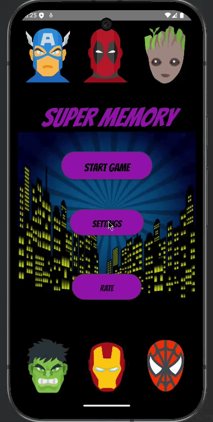

# Super Memory

An Android memory matching game built with Kotlin and Android Studio. The application challenges players to find matching pairs before the timer expires, with successful matches awarding bonus time.

The game includes randomized card placement, three difficulty levels, match tracking, win and loss states, animations, and preserved game state when returning to an active session.

> This is an independently developed personal project. All application code, game logic, interface behavior, and visual design were implemented by me. Character icons were not designed by me. 

## Demo

The animation below was recorded using the Android Studio emulator and shows a complete gameplay session, including difficulty selection, card matching, timer updates, bonus time, and the win condition.

  

## Features

- Three difficulty levels with 60-, 40-, and 20-second timers
- Randomized card placement for each game
- Match tracking throughout the session
- Bonus time awarded for successful matches
- Win and loss states based on matches completed and remaining time
- Card flip and character animations
- Reset and quit controls
- Difficulty selection saved between screens
- Active game state preserved when returning to an ongoing session

## How It Works

1. The player selects a difficulty level, which determines the starting timer.
2. A set of matching character cards is randomized and placed across the game board.
3. The player selects two cards at a time to check for a match.
4. Matching cards remain face up, while non-matching cards are flipped back over.
5. Successful matches update the match counter and award bonus time.
6. The game continues until all pairs are matched or the timer reaches zero.
7. If all pairs are found, the game displays the win state and plays the completion animation. If time expires first, the game displays the loss state.

## Implementation

### `MainActivity.kt`

Handles the main menu and navigation, including:

- starting a new game
- opening the difficulty settings screen
- character image animations
- passing the selected timer value into the game activity

### `GameSetting.kt`

Handles difficulty selection and saved settings, including:

- Easy, Normal, and Hard difficulty options
- timer values associated with each difficulty
- selected difficulty state
- storing and loading settings with `SharedPreferences`

### `GameActivity.kt`

Contains the main game logic, including:

- randomized card placement
- card selection and matching
- match tracking
- bonus-time updates
- countdown timer behavior
- reset and quit controls
- win and loss states
- end-of-game animations

## Technologies

- Kotlin
- Android Studio
- Android SDK
- XML
- ConstraintLayout
- LinearLayout
- SharedPreferences

## Limitations

- The game uses a fixed 12-card board and does not support different board sizes.
- Difficulty levels are limited to three predefined timer values.
- Active game state is preserved while the app remains in memory, but a game is not restored after the app process is fully terminated.
- The interface uses fixed layout dimensions and was designed primarily around a phone-sized display, so it may not scale perfectly across all Android screen sizes.